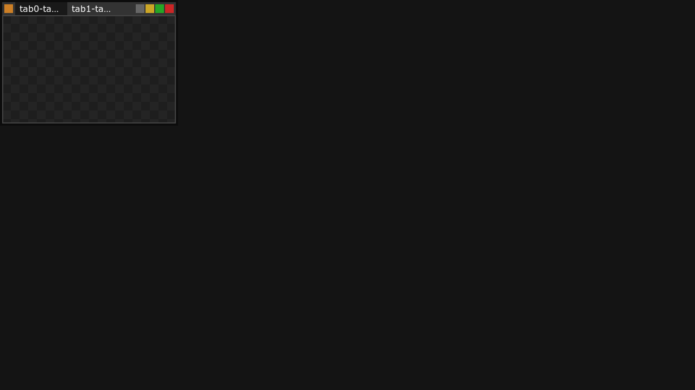
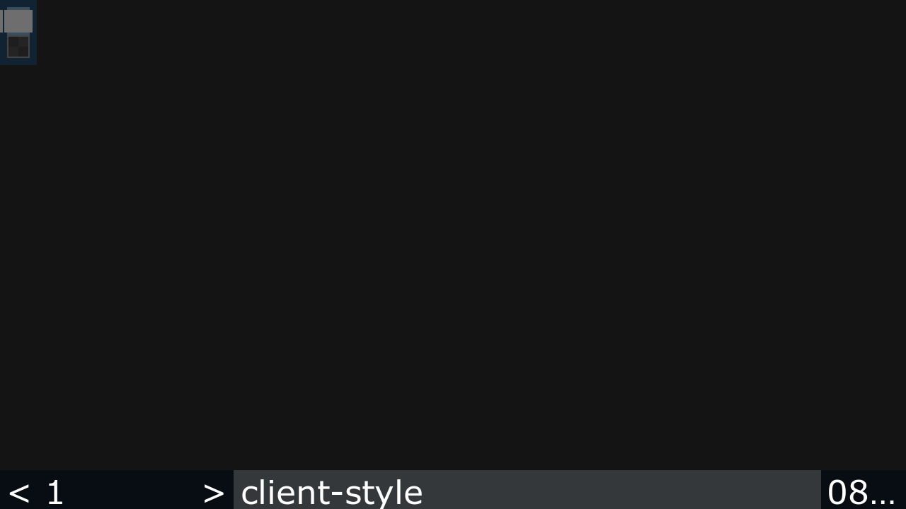
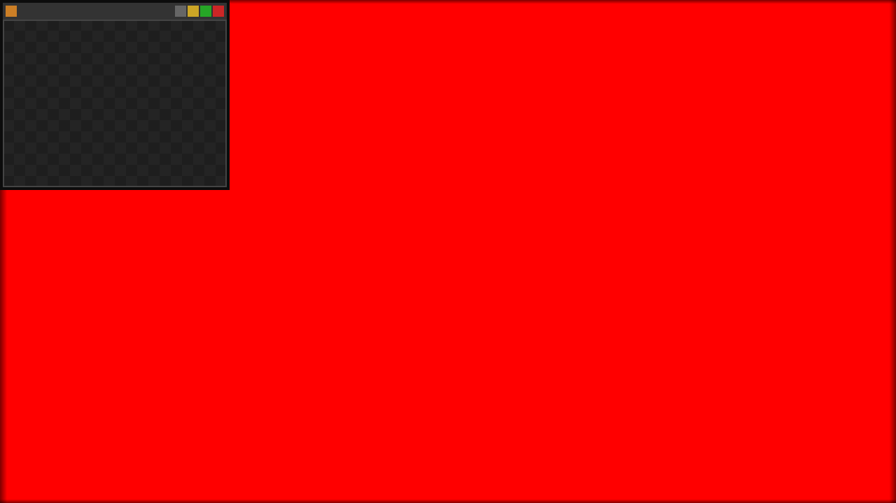
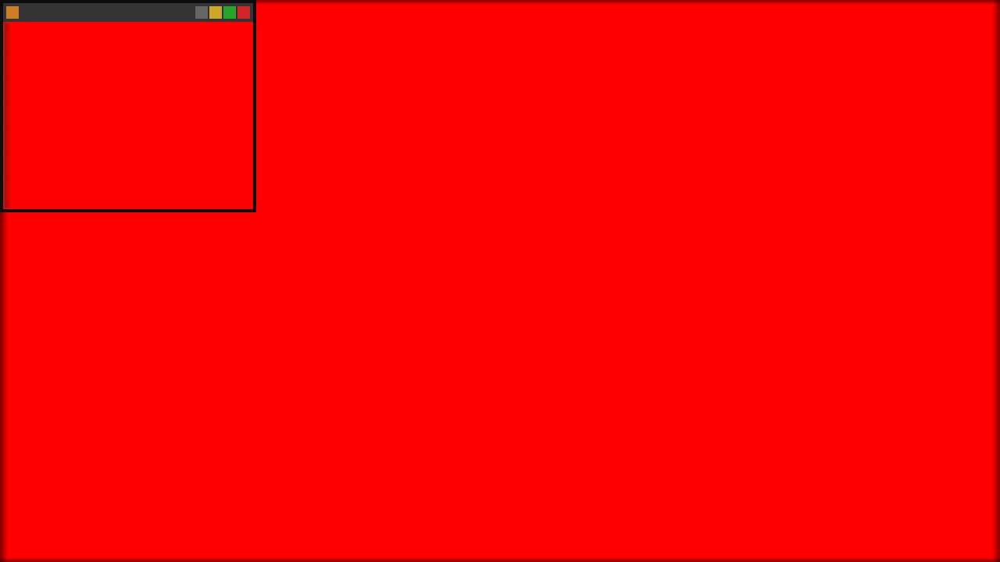
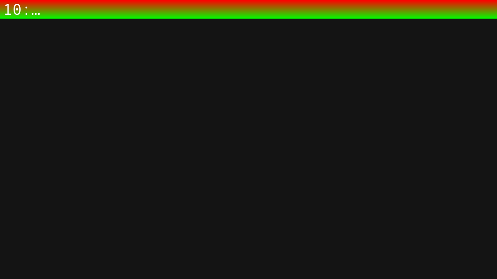
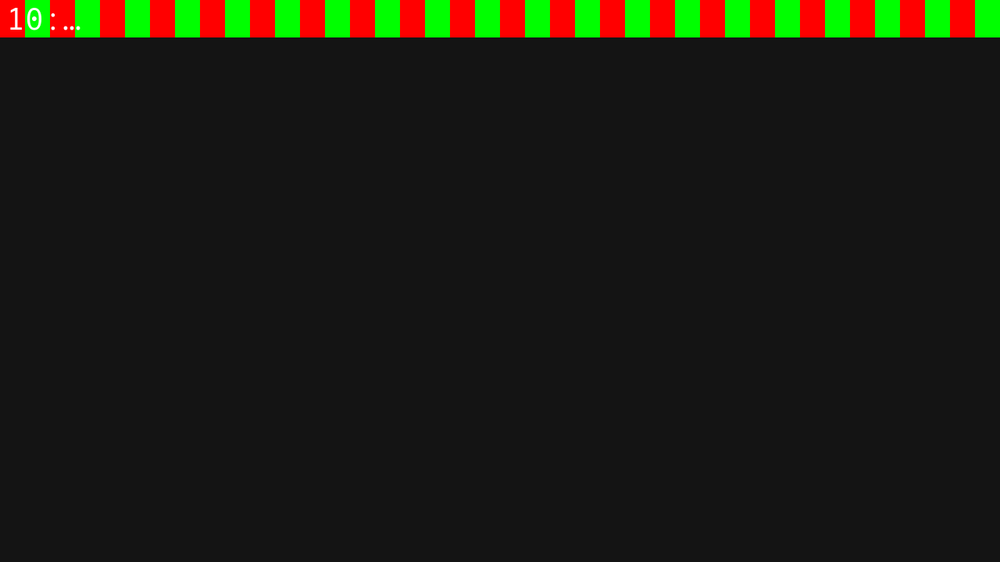
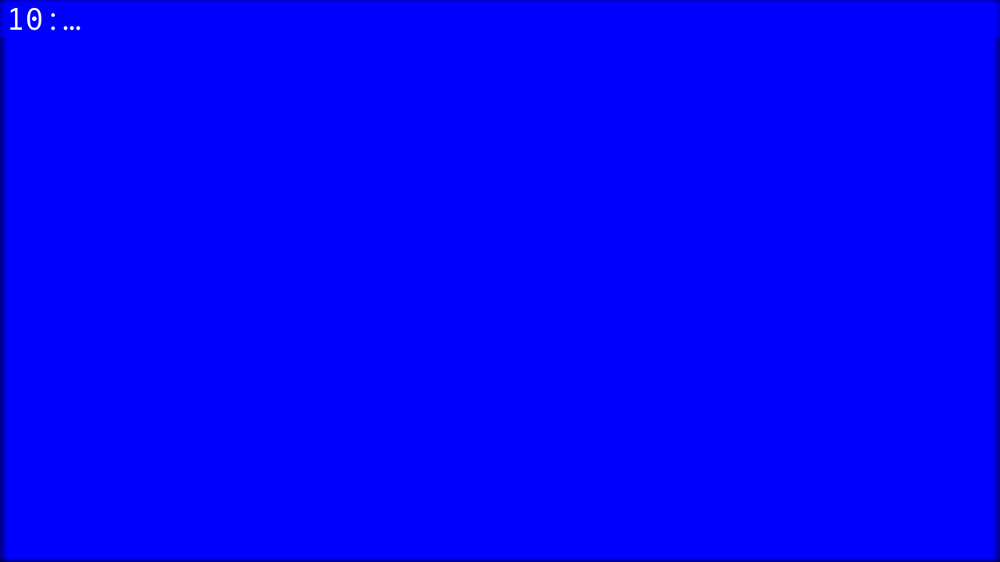

# fluxbox-wayland

`fluxbox-wayland` is a **wlroots-based Wayland compositor** with Fluxbox-like policy (root menu, key/mouse bindings, workspaces, theming, lightweight).

This repo is an experimental/WIP port of Fluxbox concepts from X11 to Wayland:

- **`fluxbox-wayland` is a compositor**, not an X11 window manager running “on top of” Wayland.
- It manages native Wayland `xdg_toplevel` apps and can optionally run X11 apps via **XWayland**.
- Classic Fluxbox config formats are intentionally reused with an explicit **1:1 parity** target; remaining gaps are tracked in `whatsleft.md`.

Project notes / work tracking:

- `plan.md` (overall port plan + status snapshot)
- `whatsleft.md` (remaining parity tasks)

## Screenshots

All screenshots below are tracked in git under `docs/screenshots/` so GitHub can render them directly.
There is also a standalone HTML gallery at `docs/screenshots/index.html` (works locally; can be served via GitHub Pages).

<table>
  <tr>
    <td align="center">
      
       
      Root menu via left-click (common apps)
    </td>
    <td align="center">
      
       
      Tabs UI (autotab placement)
    </td>
    <td align="center">
      
       
      Style/theme parsing (thick border + tall titlebar)
    </td>
  </tr>
  <tr>
    <td align="center">
      
       
      Per-window alpha over a generated spiral wallpaper
    </td>
    <td align="center">
      
       
      Transparency with compositing (alpha shows background color)
    </td>
    <td align="center">
      
       
      Forced pseudo-transparency (alpha samples wallpaper)
    </td>
  </tr>
  <tr>
    <td align="center">
      
       
      Style texture: gradient
    </td>
    <td align="center">
      
       
      Style texture: tiled pixmap
    </td>
    <td align="center">
      
       
      Style texture: ParentRelative
    </td>
  </tr>
</table>

## Build / Run (quick notes)

- Build: `./autogen.sh && ./configure --enable-wayland && make -j` (or Wayland-only: `./configure --disable-x11 --enable-wayland`)
- Run (recommended): `util/startfluxbox-wayland`
- Smoke tests: `scripts/fbwl-smoke-all.sh`

To regenerate screenshots in `docs/screenshots/`:

- `FBWL_SMOKE_REPORT_DIR=docs/screenshots scripts/fbwl-smoke-left-click-menu.sh`
- `FBWL_SMOKE_REPORT_DIR=docs/screenshots scripts/fbwl-smoke-tabs-ui-click.sh`
- `FBWL_SMOKE_REPORT_DIR=docs/screenshots scripts/fbwl-smoke-style.sh`
- `FBWL_SMOKE_REPORT_DIR=docs/screenshots scripts/fbwl-smoke-style-textures.sh`
- `FBWL_SMOKE_REPORT_DIR=docs/screenshots scripts/fbwl-smoke-window-alpha.sh`
- `FBWL_SMOKE_REPORT_DIR=docs/screenshots scripts/fbwl-smoke-pseudo-transparency.sh`
